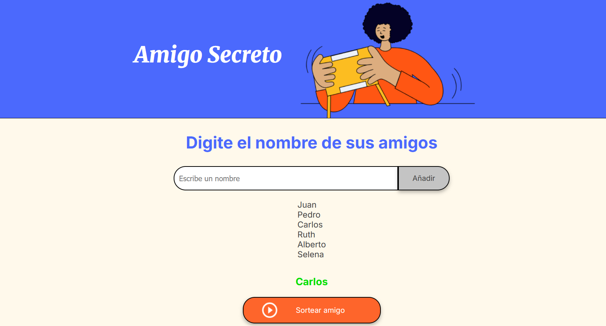

# 🎁 Amigo Secreto

Aplicación web para realizar el sorteo de **Amigo Secreto** de manera sencilla y rápida.  
Permite ingresar participantes y asignar los emparejamientos de forma aleatoria, asegurando que nadie se asigne a sí mismo.

---

## 🖼️ Capturas de pantalla

### Pantalla principal
*(Agrega aquí una imagen de la interfaz inicial, por ejemplo:)*  

### Sorteo en acción
*(Otra imagen mostrando cómo se asignan los amigos secretos)*  

### Resultados
*(Una última captura mostrando los resultados finales)*  

---

## 📂 Estructura del Proyecto

